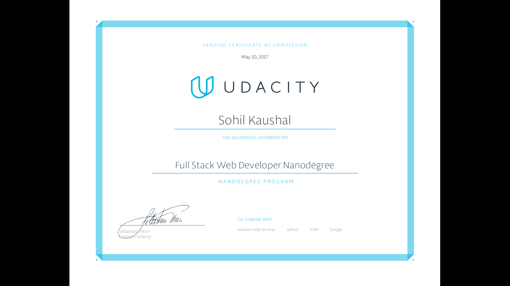

# Full Stack Web Developer Nanodegree

* This is my repository for my Nanodegree in **FULLSTACK WEB DEVELOPMENT** by `Udacity`.

## INDEX
* Project Info
* Languages Used

### Project Info

* Movie Trailer Website
* Portfolio Project
* MultiUser Blog
* Item Catalog
* Linux Server Configuration

### Languages Used

* Python  
* HTML
* CSS
* JavaScript
* jQuery
* KnockoutJS.
* Using Google Maps & other third party API's.
* Various Linux terminal Commands used to configure server.

###### Made By :-
          Sohil Kaushal
###### Certificate :-
  
  
